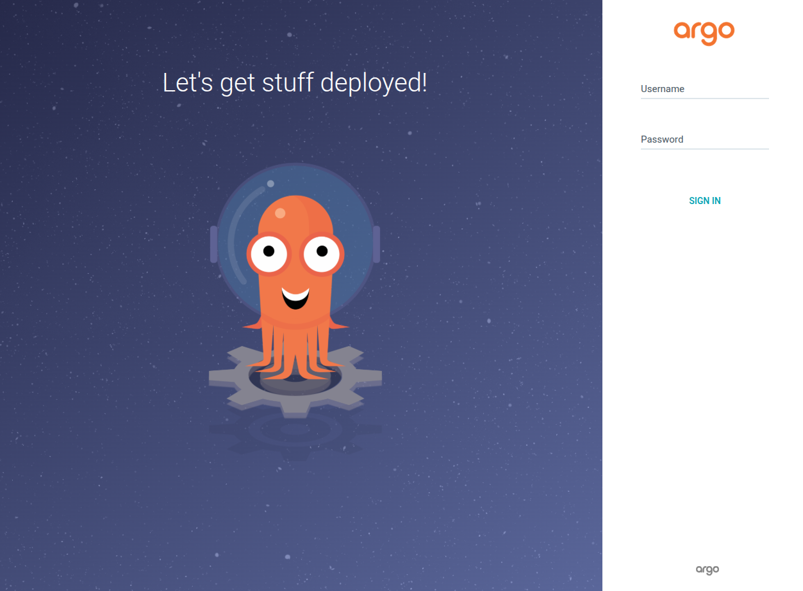
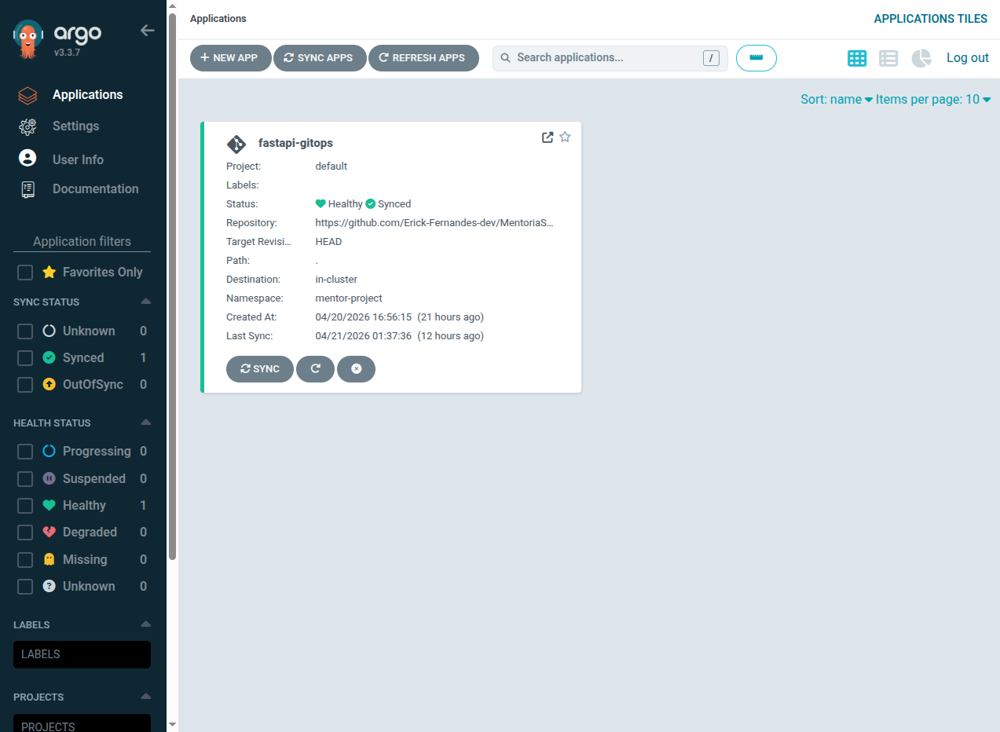
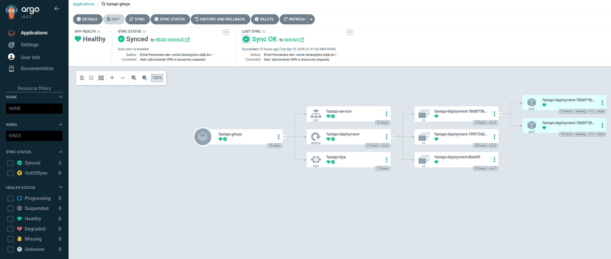

# 🚀 FastAPI & GitOps: Do Código ao Auto-Scaling no Kubernetes

Este repositório contém o **Desafio 03** da Mentoria SRE. O objetivo deste laboratório é demonstrar a jornada completa de uma aplicação: desde o desenvolvimento usando **Clean Architecture** em Python, passando pela conteinerização com **Docker**, até o deploy automatizado utilizando **ArgoCD (GitOps)** e Auto-Scaling com **HPA** em um cluster Kubernetes.

---

## 🏗️ 1. Arquitetura da Aplicação (Clean Architecture)

A aplicação é uma API REST construída com **FastAPI** para gerenciamento de tarefas (Tasks). O projeto foi estruturado para separar responsabilidades, facilitando testes e futuras trocas de banco de dados.

### Estrutura de Diretórios

```
Desafio-03/
├── app/
│   ├── main.py
│   ├── domain.py
│   ├── use_cases.py
│   └── repository.py
├── infra/
│   ├── deployment.yaml
│   ├── service.yaml
│   └── hpa.yaml
├── .argocdignore
├── Dockerfile
└── requirements.txt
```

### 1.1 Dependências (`requirements.txt`)

```
fastapi>=0.110.0
uvicorn[standard]>=0.29.0
pydantic>=2.6.0
```

### 1.2 Código da Aplicação (`app/`)

Para fins de prática, aqui está a estrutura básica dos arquivos Python para rodar a aplicação:

**`app/domain.py`** (Modelos de Dados)

```python
from pydantic import BaseModel
from typing import Optional

class Task(BaseModel):
    id: Optional[int] = None
    title: str
    description: Optional[str] = None
    completed: bool = False

class TaskCreate(BaseModel):
    title: str
    description: Optional[str] = None
```

**`app/main.py`** (Ponto de Entrada e Rotas)

```python
from fastapi import FastAPI, Depends, HTTPException
from typing import List

from .domain import Task, TaskCreate
from .use_cases import TaskService
from .dependencies import get_task_service

app = FastAPI(title="Clean API Kubernetes")

@app.get("/")
def health_check():
    return {"status": "Runing", "architecture": "Clean Code"}

@app.post("/tasks", response_model=Task, status_code=201)
def create_task(
        task: TaskCreate,
        service: TaskService = Depends(get_task_service)
):
    try:
        return service.create_task(task)
    except ValueError as e:
        raise HTTPException(status_code=400, detail=str(e))

@app.get("/tasks", response_model=List[Task])
def list_tasks(service: TaskService = Depends(get_task_service)):
    return service.list_tasks()
```

`app/dependencies.py` (Depedencias)

```python
from .repository import TaskRepository
from .use_cases import TaskService

# Instanciamos o repositório como um "Singleton" (única instância) para manter os dados em memória
task_repository = TaskRepository()

def get_task_service() -> TaskService:
    # Criamos a instância do caso de uso, injetando o repositório
    return TaskService(repository=task_repository)
```

`app/repository.py` (Vamos simular nosso banco de dados)

```python
from typing import List, Optional
from .domain import Task, TaskCreate

class TaskRepository:
    def __init__(self):
        # Simulando um banco de dados em memória
        self._db: dict[int, Task] = {}
        self._current_id: int = 1
    
    def save(self, task: Task) -> Task:
        task.id = self._current_id
        self._db[self._current_id] = task
        self._current_id += 1
        return task

    def get_all(self) -> List[Task]:
        return list(self._db.values())

    def get_by_id(self, task_id: int) -> Optional[Task]:
        return self._db.get(task_id)

```

`app/use_cases.py` (Aqui é onde se encontra as regras na nossa API)

```python
from .domain import Task, TaskCreate
from .repository import TaskRepository

class TaskService:

    def __init__(self, repository: TaskRepository):
        self.repository = repository
    
    def create_task(self, task_data: TaskCreate) -> Task:
        # Regra de negócio: O título da tarefa não pode ter menos de 3 caracteres
        if len(task_data.title) < 3:
            raise ValueError("O título da tarefa deve ter pelo menos 3 caracteres.")
        
        new_task = Task(
            title=task_data.title,
            description=task_data.description,
        )

        return self.repository.save(new_task)

    def list_tasks(self) -> list[Task]:
        return self.repository.get_all()
        
```

---

## 🐳 2. Conteinerização com Docker

Para garantir a imutabilidade, a aplicação foi empacotada em uma imagem Docker otimizada.

**`Dockerfile`**

```docker
# Usa uma imagem oficial e leve do python
FROM python:3.11-slim

# Define o diretório de trabalho DENTRO do container
WORKDIR /code

# Copia apenas o arquivo de requisitos primeiro (aproveita o cache do docker)
COPY requirements.txt .

# Instala as dependências de sua API
RUN pip install --no-cache-dir -r requirements.txt

# Agora, copia a sua pasta 'app' local para dentro de uma 'app' no container
COPY ./app ./app

# Expõe a porta que a API vai rodar
EXPOSE 8008

# Inicia o Uvicorn, apontando para o arquivo main.py dentro da pasta do projeto
CMD ["uvicorn", "app.main:app", "--host", "0.0.0.0", "--port", "8008"]
```

**Comandos para Build e Push:**

```bash
# Login do Docker
docker login

# Faça o build da imagem (substitua 'seu_usuario' pelo seu Docker Hub)
docker build -t seu_usuario/fastapi-k8s:v1 .

# Envie para o registry
docker push seu_usuario/fastapi-k8s:v1
```

---

## ⚙️ 3. Infraestrutura Kubernetes (Manifestos)

A infraestrutura foi declarada em arquivos YAML localizados na pasta `infra/`. Todos os recursos rodam no namespace `mentor-project`.

**`infra/deployment.yaml`***Nota: A linha `replicas` foi propositalmente removida para permitir que o HPA assuma o controle do dimensionamento.*

```yaml
apiVersion: apps/v1
kind: Deployment
metadata:
  name: fastapi-deployment
  namespace: mentor-project
  labels:
    app: fastapi-app
spec:
  selector:
    matchLabels:
      app: fastapi-app
  template:
    metadata:
      labels:
        app: fastapi-app
    spec:
      containers:
      - name: fastapi-container
        image: seu_usuario/fastapi-k8s:v1 # Altere para sua imagem
        ports:
        - containerPort: 8008
        resources:
          requests:
            cpu: "50m"
            memory: "64Mi"
          limits:
            cpu: "200m"
            memory: "256Mi"
```

**`infra/service.yaml`**

```yaml
apiVersion: v1
kind: Service
metadata:
  name: fastapi-service
  namespace: mentor-project
spec:
  selector:
    app: fastapi-app
  type: ClusterIP
  ports:
    - protocol: TCP
      port: 80
      targetPort: 8008
```

**`infra/hpa.yaml`**

```yaml
apiVersion: autoscaling/v2
kind: HorizontalPodAutoscaler
metadata:
  name: fastapi-hpa
  namespace: mentor-project
spec:
  scaleTargetRef:
    apiVersion: apps/v1
    kind: Deployment
    name: fastapi-deployment
  minReplicas: 2
  maxReplicas: 10
  metrics:
  - type: Resource
    resource:
      name: cpu
      target:
        type: Utilization
        averageUtilization: 50
```

---

## 🐙 4. Configuração do ArgoCD (GitOps)

### 4.1 Instalando o ArgoCD no Cluster

Devido ao tamanho dos manifestos (CRDs) do ArgoCD, é necessário utilizar o `server-side apply` para evitar erros de limite de anotação.

```bash
# Criação do namespace
kubectl create namespace argocd

# Instalação forçando o Server-Side Apply
kubectl apply -n argocd -f <https://raw.githubusercontent.com/argoproj/argo-cd/stable/manifests/install.yaml> --server-side --force-conflicts
```

### 4.2 Acessando a Interface (Port-Forward)

Para acessar o ArgoCD em uma máquina remota ou servidor, expomos a porta para todas as interfaces (`0.0.0.0`):

```bash
kubectl port-forward svc/argocd-server -n argocd 8080:443 --address 0.0.0.0
```

*Acesse no navegador: `https://<IP_DO_SERVIDOR>:8080`*

Para resgatar a senha inicial do admin:

```bash
kubectl -n argocd get secret argocd-initial-admin-secret -o jsonpath="{.data.password}" | base64 -d
```

Tela de login do ArgoCD



Após a instalação do ArgoCD, implemente esse manifesto de configuração apontando para o repositório e o Projeto.

```yaml
apiVersion: argoproj.io/v1alpha1
kind: Application
metadata:
  name: fastapi-gitops
  namespace: argocd
spec:
  project: default
  source:
    repoURL: 'https://github.com/Erick-Fernandes-dev/MentoriaSRE.git'
    targetRevision: HEAD
    path: . # Pasta onde os YAMLs estão no repositório
    directory:
      recurse: true # É isso que ativa a recursividade via código!
  destination:
    server: 'https://kubernetes.default.svc'
    namespace: mentor-project # namespace do projeto
  syncPolicy:
    automated:
      prune: true
      selfHeal: true # O ArgoCD vai forçar o cluster a ser idêntico ao Git
```

Após a configuração o ArgoCD vai passar a enxergar o seu projeto



O projeto está saudável e executando com sucesso



---

## 📈 5. Configuração do Auto-Scaling (Metrics Server)

Para o HPA funcionar em um cluster local como o **Kind**, o Metrics Server precisa de um ajuste de segurança (TLS Insecure) para se comunicar com os nós.

**Comandos:**

```bash
# 1. Instala o Metrics Server oficial
kubectl apply -f <https://github.com/kubernetes-sigs/metrics-server/releases/download/v0.5.0/components.yaml>

# 2. Patch para permitir TLS inseguro em ambiente local (Kind)
kubectl patch deployment metrics-server -n kube-system --type='json' -p='[{"op": "add", "path": "/spec/template/spec/containers/0/args/-", "value": "--kubelet-insecure-tls"}]'
```

*Validação: Aguarde 60 segundos e rode `kubectl top pods -n mentor-project`.*

---

## 🧪 6. Testes Práticos no Laboratório

Para validar a arquitetura, execute as seguintes simulações:

### Teste de Deploy (GitOps)

1. Crie o namespace do projeto: `kubectl create namespace mentor-project`.
2. Conecte o repositório no ArgoCD apontando para a pasta `Desafio-03/infra`.
3. Verifique os Pods nascendo no terminal:

```bash
kubectl get pods -n mentor-project -w
```

### Teste de Auto-Healing (Resiliência)

Delete um pod aleatório e observe o Kubernetes recriá-lo imediatamente para manter a escala declarada de 2 réplicas mínimas.

```bash
kubectl delete pod <nome-do-pod> -n mentor-project
```

### Teste de HPA (Escalabilidade)

Acompanhe o consumo de CPU em tempo real:

```bash
kubectl get hpa -n mentor-project -w
```

Faça requisições em loop contra a sua API. Ao ultrapassar 50% de uso de CPU, o cluster automaticamente criará novos pods até o limite de 10.

---